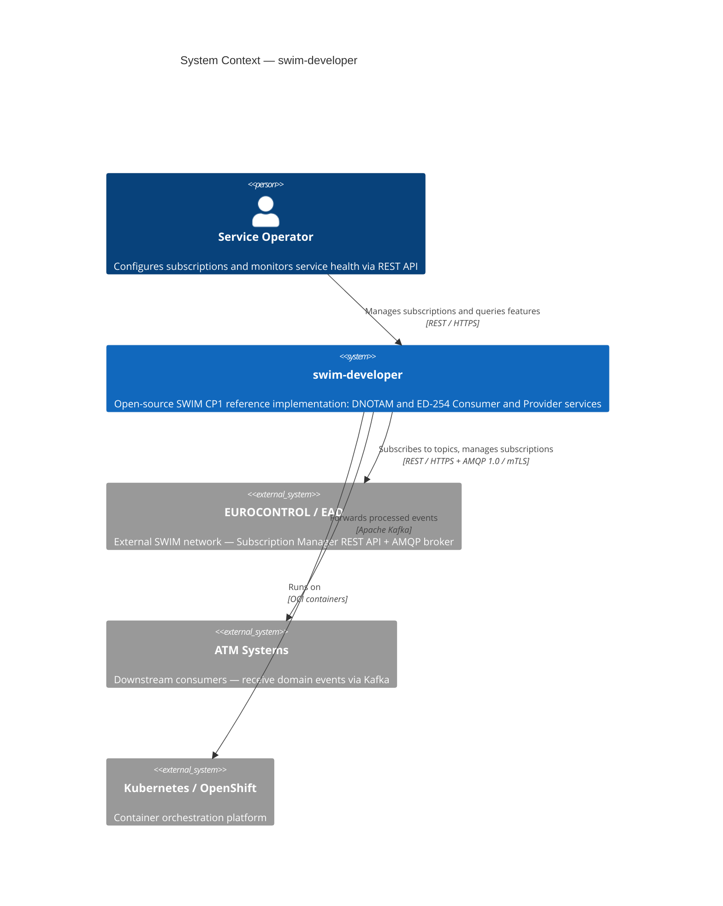
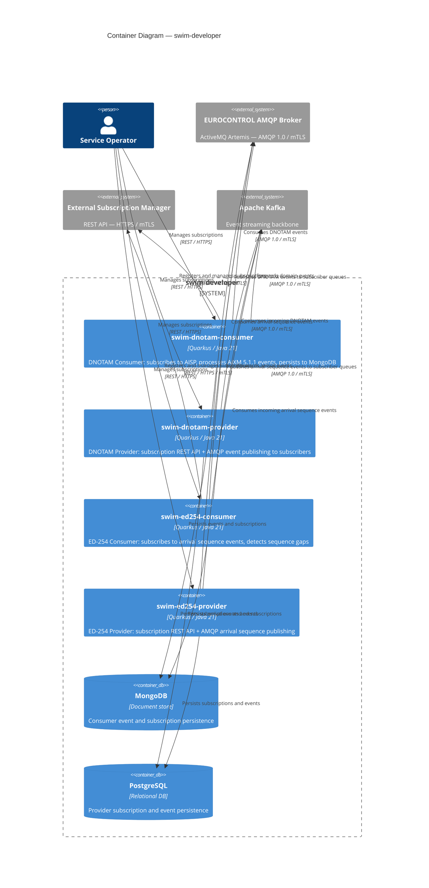
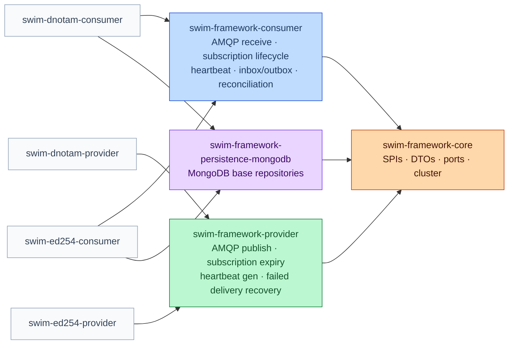
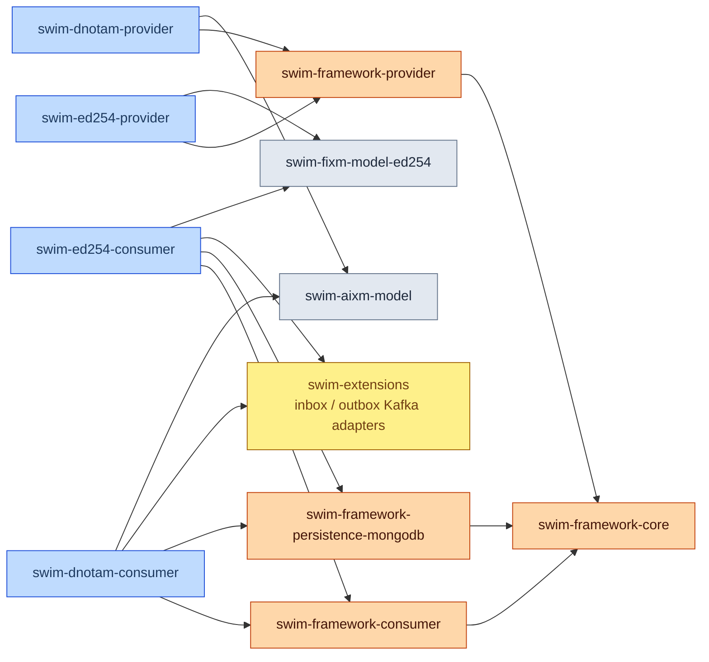

# swim-developer — Architecture

> Diagrams use [Mermaid](https://mermaid.js.org) and render natively on GitHub.

---

## 1. System Context (C4 Level 1)

---

## 2. Container Diagram (C4 Level 2)

---

## 3. swim-framework — Module Hierarchy

---

## 4. Maven Dependency Graph

---

## Architecture Principles

| Principle | Applied |
|-----------|---------|
| **Hexagonal Architecture** | Domain and ports are isolated from infrastructure. Adapters implement ports; never the reverse. |
| **Template Method** | Framework abstract classes define the algorithm skeleton. Services implement only the domain-specific steps. |
| **Consumer ↔ Provider isolation** | A consumer never connects to the provider of the same module. During development, consumers connect to consumer-validators (dedicated test harnesses). |
| **At-least-once delivery** | AMQP message handlers are idempotent. Events are acknowledged only after successful persistence. |
| **mTLS everywhere** | All service-to-service communication uses mutual TLS with X.509 certificates injected as Kubernetes Secrets. |
